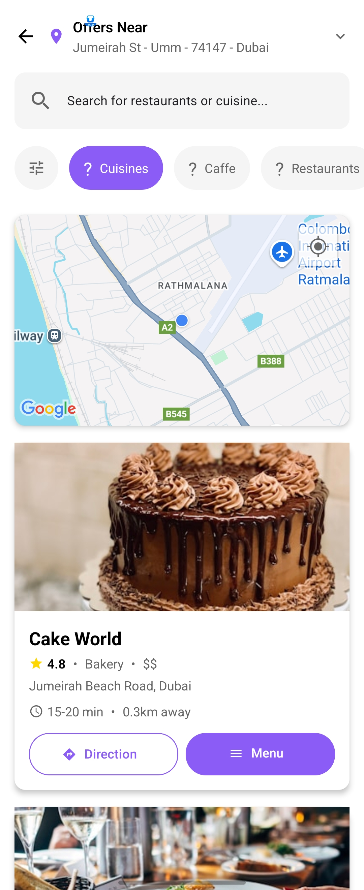

# Restaurant Bay App -

## Getting Started

To get started with the Restaurant Bay App, follow these steps:

1. Clone the repository:

```bash
git clone https://github.com/your-username/restaurant-bay-app.git
```

2. Navigate to the project directory:

```bash
cd restaurant-bay-app
```

3. Install the required dependencies:

```bash
yarn install
```

4. Run the development server:

```bash
yarn  start
```

## Android Setup

To set up the Android version of the app, follow these steps:

1. Open the `android` directory in Android Studio.
2. Click on `File > Sync Project with Gradle Files`.
3. Wait for the Gradle files to sync.
4. Run the app on an Android device or emulator.

## iOS Setup

To set up the iOS version of the app, follow these steps:

1. Open the `ios` directory in Xcode.
2. Click on `Build > Build`.

## Features ✨

- 🗺️ **Interactive Map View** - See restaurants near your location
- 🔍 **Smart Search** - Find restaurants by name, cuisine, or location
- 📜 **Detailed Menus** - Browse full menus with dietary information
- 📍 **Get Directions** - One-tap navigation to any restaurant
- 🏷️ **Special Offers** - View current discounts and promotions
- ⏱️ **Delivery Estimates** - See preparation and delivery times

## Screenshots 📸

### Restaurant Discovery

| Home Screen                                            | Restaurant List                                        | Filter View                                            |
| ------------------------------------------------------ | ------------------------------------------------------ | ------------------------------------------------------ |
|  |  |  |
